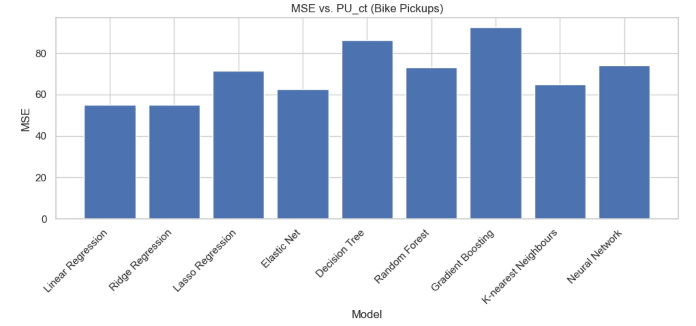
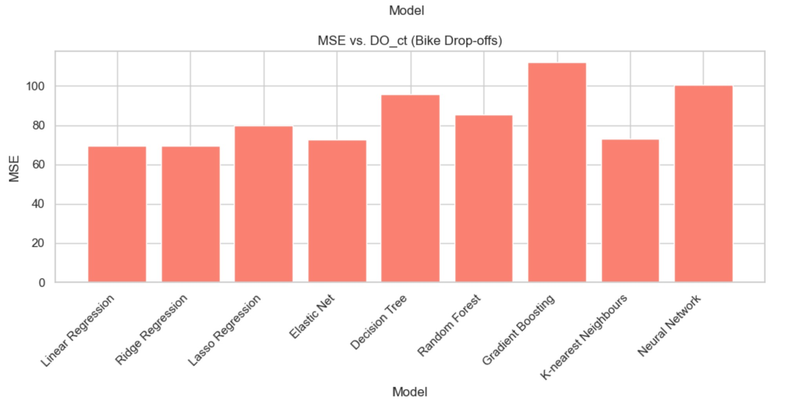
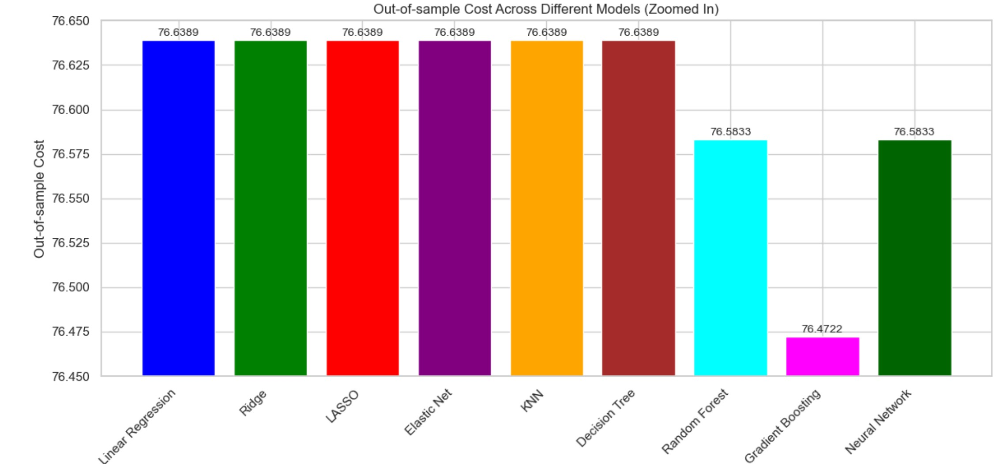

# Predictive Modeling of Bikeshare Demand: A Study on Capital Bikeshare
This project analyzed Capital Bikeshare data using Linear, Ridge, LASSO, Elastic Net, KNN, Regression Tree, Random Forest, Gradient Boosting, and Neural Network models to forecast ridership and improve operational efficiency.

### Basic Information

* **Person or organization developing model**: N M Emran Hussain `nmemran.hussain@gwu.edu`
* **Model date**: March, 2025
* **Model version**: 1.0 
* **License**: [Apache License 2.0](https://github.com/nmemranhussain/RML_A_1_Group_11/blob/main/LICENSE)
* **Model implementation code**: [Assignment](https://github.com/nmemranhussain/6315_A_3/blob/main/6315_A_3_final.ipynb)
* **Final report**: [Final Report](https://github.com/nmemranhussain/6315_A_3/blob/main/6315_A_3_final_report.pdf)

### Training Data

* Data dictionary: 

| Name | Modeling Role | Measurement Level| Description |
|------|---------------|------------------|-------------|
| Date	| Input	| Date	| Date of observation |
| Datetime |	Input	| Date	| Date of observation |
| Tempmax	| Input	|Interval	|Maximum daily temperature (°F) |
| Tempmin	| Input	| Interval	| Minimum daily temperature (°F) |
| Temp	| Input	| Interval	| Average temperature (°F) |
| Feelslikemax	| Input	| Interval	| Maximum feels-like temperature (°F) |
| Feelslikemin	| Input	| Interval	| Minimum feels-like temperature (°F) |
| Feelslike	| Input	| Interval	| Average feels-like temperature (°F) |
| Dew	| Input	| Interval	| Dew point temperature (°F) |
| Humidity	| Input	| Interval	| Humidity percentage |
| Precip	| Input	| Interval	| Total daily precipitation (inches) |
| Precipprob	| Input	 | Interval	| Probability of precipitation (%) |
| Precipcover	| Input	| Interval	| Proportion of the day with precipitation (0 to 1 scale) |
| Snow	| Input	| Interval	| Daily snowfall amount (inches) |
| Snowdepth	| Input	| Interval	| Snow depth on the ground at day's end (inches) |
| Windspeed	| Input	| Interval	| Wind speed (mph) |
| Winddir	| Input	| Interval	| Wind direction (degrees) |
| Sealevelpressure	| Input	| Interval	| Sea level pressure (hPa) |
| Cloudcover	| Input	| Interval	| Cloud cover (%) |
| Visibility	| Input	| Interval	| Visibility (miles) |
| Solarradiation	| Input	| Interval	| Solar radiation (W/m²) |
| Solarenergy	| Input	| Interval	| Solar energy (MJ/m²) |
| Uvindex	| Input	| Interval	| UV index |
| Moonphase	| Input	| Interval	| Moon phase (0=new, 1=full) |
| Icon	| Input	| Nominal	| Weather icon for the day |
| Which_High | Output | Categorical | Whether Pickups or Drop-offs are higher on a given day (PU_High or DO_High) |

- **Source of Taining Dataset Name:** Capital Bikeshare Data ('202402-capitalbikeshare-tripdata.csv', '202403-capitalbikeshare-tripdata.csv', '202404-capitalbikeshare-tripdata.csv' & 'DC_weather_2024.csv')  
- **Number of Samples:** 318689, 436947, 490266 & 367  
- **Features Used:** Temporal Features (hour, weekday, months), Weather Features (temp, precip, windspeed, uvindex, icon), Station Usage Features (Pickup count and Drop-off count)
- **Target variable Used:** Pickup count (PU_ct) and Drop-off count (DO_ct)
- **Data Source:** [capitalbikeshare-data](https://s3.amazonaws.com/capitalbikeshare-data/index.html)
- **How training data was divided into training and test data**: Training (60%) and testing (40%).
- **Type of model**: Linear, Ridge, LASSO, Elastic Net, KNN, Regression Tree, Random Forest, Gradient Boosting and Neural Network
- **Software used to implement the model**: Python, numpy, scikit-learn
- **Version of the modeling software**: numpy: 2.0.2, pandas: 2.2.2, matplotlib: 3.10.0, Python 3.11.12, scikit-learn version: 1.5.1

### Evaluation Metrics

- **Mean Squared Error (MSE):** Here MSE is used for both Number of bike pickups (PU_ct) and Number of drop-offs or dock availability (DO_ct). It measures average squared differences between actual and predicted values. Lower MSE indicates better prediction accuracy.
- **Out-of-Sample Cost:** A custom business-oriented metric reflecting operational decision cost (e.g., misallocation or imbalance). If a model has a higher MSE, it might still produce better real-world outcomes based on this cost.
- **Visual Evaluation (Charts/Plots):** Line plots and bar charts were used to compare prediction errors across models and to zoom into subtle differences in out-of-sample cost. It helps us to assess model visual effectiveness for decision-making.

### Quantitative Analysis
- **Table of Performance Evaluation**

| Model Name | Hyperparameter tuning of the models | MSE of PU_ct | MSE of DO_ct | Out-of-sample-cost |
|-------------------|------------------------------------|---------------|-------------|---------------------|
| Linear Regression | - | 54.8884 | 69.5465 | 76.6389 |
| Ridge | Alpha = 100 | 54.8891 | 69.5454 | 76.6389 |
| LASSO | Alpha =  10 | 71.5580 | 79.7125 | 76.6389 |
| Elastic Net | Alpha = 100 | 62.5541 | 72.4992 | 76.6389 |
| Decision Tree | max_depth = 1 | 86.3950 | 95.9265 | 76.6389 |
| Random Forest |  For PU_ct: max_depth = 5, min_samples_split = 10, n_estimators = 200 and For DO_ct: max_depth = 5, min_samples_split = 10, n_estimators = 200 | 73.1887 | 85.3664 | 76.5833 |
| Gradient Boosting |learning_rate = 0.05, n_estimators = 50 | 92.4546 | 111.9453 | 76.4722 |
| KNN | n_neighbors = 10 | 64.9297 | 72.8519 | 76.6389 |
| Neural Network | alpha = 0.01, hidden_layer_sizes = (100,) | 74.2597 | 100.5584 | 76.5833 |

- **Plots of Performance Evaluation**
  
  
Figure 1. MSE vs. Number of Pick-ups (PU_ct) across all models

  
Figure 2. MSE vs. Number of Drop-offs (DO_ct) across all models

  
Figure 3. Out-of-sample-cost (zoomed-in) across all models

- **Decision Performance Evaluation**
From the tables and plots given above, Linear & Ridge Regression show the lowest MSE for both PU_ct and DO_ct, indicating better numerical prediction accuracy. LASSO, Elastic Net, and KNN show higher MSEs but all models have the almost same out-of-sample-cost. This suggests the prediction errors may not translate to worse operational decisions. Decision Tree performs the worst across all metrics. Random Forest and Neural Network have higher MSEs, but produce the lowest out-of-sample-cost (76.5833) meaning they make better allocation decisions. Gradient Boosting has the lowest out-of-sample-cost overall (76.4722) despite high MSEs, suggesting it's most effective in operational terms.

### Findings, recommendations, and limitations
This project analyzed Capital Bikeshare usage data from February to April 2024 to enhance operational decision-making through predictive modeling. The analysis revealed that while Linear and Ridge Regression achieved the lowest prediction errors (MSE) for bike pickups (PU_ct) and dock availability (DO_ct), they did not perform best in operational terms. Interestingly, Gradient Boosting, despite having higher MSEs, resulted in the lowest out-of-sample cost, indicating superior real-world decision impact. This was closely followed by Random Forest and Neural Networks, suggesting that more complex models may offer better cost-oriented outcomes even with lower predictive accuracy.

If the goal is to prioritize numerical prediction accuracy and the small differences in out-of-sample cost (within ~0.16 units) are operationally negligible, then Linear and Ridge Regression are strong choices. These models are simpler, more interpretable, and computationally efficient. However, when fine-tuned cost efficiency or real-time operational decisions are critical, ensemble models like Gradient Boosting or Random Forest may be better suited due to their slightly superior performance in decision-based outcomes. Therefore, the choice of model should depend on the business context—whether the priority is simplicity and prediction accuracy or complex, optimized allocation decisions.

This analysis has several limitations. The models may be sensitive to feature scaling and require more robust hyperparameter tuning. The use of static weather data and a limited historical window (only three months) restricts the generalizability of the results. Additionally, user behavior patterns and real-time dynamics were not incorporated. Future work should explore longer time periods, adaptive learning with real-time data, and behavioral features to build more dynamic and effective forecasting systems for bikeshare operations.

